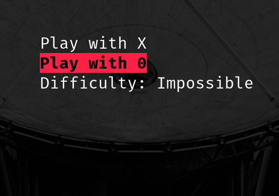
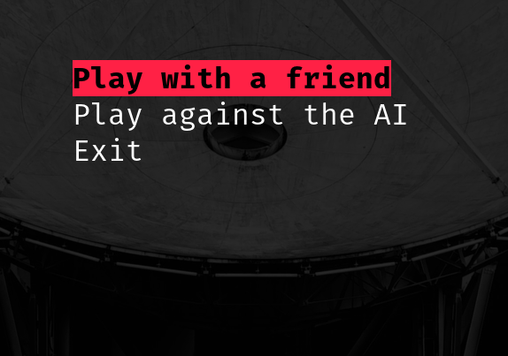

# TIC-TAC-BASH #
 
 This began as a small project for my Operating Systems course meant to recreate a game of Tic-Tac-Toe in the Bash terminal using ncurses.
 
 After finishing taking my first AI course I got inspired to put my knowledge to the test and implement a minimax algorithm in order to build an intelligent adversary to play against. 

 I also built an intuitive menu for the whole project, tying it all together.

 ## Instalation ##

In order to install this project on your computer what you have to to is run:
``` make install ``` 
which will put this game's executable on your OS' $PATH (/usr/local/bin)

You can move the executable anywhere on the path yourself if /usr/local/bin does not work for you. You can also run this project directly from this directory with 
``` ./tic-tac-bash ```

## How to play ##

To navigate through the menu you can use the UP ARROW and DOWN ARROW. Alternatively, you can also use w to go up and s to go down. In order to select a menu option you can either use space or enter.

The first player is X. In order to pick a spot in the table they have to click on the desired spot with the mouse. There is also the option to play using the keyboard. Below is shown how the keys are mapped on the game's table:

```
q | w | e
---------
a | s | d  
---------
z | x | c
```

When the game is over, a message anouncing the winner is displayed and the player can pres any letter on the keyboard to exit. 

You can also press Q any time to exit the game.

## Some pictures
 
If you're not really sold on the idea but still want to take a look at the project without installing it on your machine, here are some pictures of the project:




